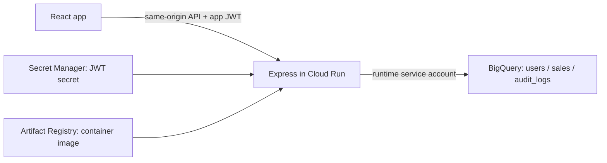

# Sales Insight Dashboard

A sales analytics proof of concept built with React, Express, and Google
BigQuery. The application provides revenue dashboards, transaction management,
product and regional analytics, user role management, and audit logs.

The frontend and API run in one Docker container deployed to **private Google
Cloud Run**. The current release has been verified with real BigQuery reads,
writes, authentication, and role-based access control.

## Features

- Revenue summaries, trends, product performance, and regional analytics.
- Paginated transactions with role-controlled creation and deletion.
- JWT authentication with bcrypt password hashes and current-user checks.
- Admin user management and role changes that affect existing sessions.
- Transactional audit logging for sales mutations and role changes.
- Responsive pages with loading, empty, error, and retry states.

## Architecture



Express serves both `/api/*` and the compiled React application. Local frontend
development uses Vite's API proxy. Cloud Run uses an attached service account
for BigQuery access and obtains the JWT secret from Secret Manager. Private
Cloud Run access requires Google IAM authentication before the application login.

| Layer | Technologies |
|---|---|
| Frontend | React 19, Vite 8, React Router, Tailwind CSS, Recharts |
| Backend | Node.js, Express 5, JWT, bcrypt, Helmet |
| Data | Google BigQuery, parameterized GoogleSQL, NUMERIC amounts |
| Deployment | Multi-stage Docker build, Artifact Registry, Cloud Run, Secret Manager |
| Testing | Node.js test runner, Playwright, live API verification |

## Repository structure

```text
client/
  src/                 React pages, components, authentication, API clients
  tests/               Browser tests and API fixtures
server/
  config/              Environment, BigQuery, and permission configuration
  controllers/         HTTP request handling
  middleware/          Authentication, authorization, routing, error handling
  routes/              Express API endpoints
  services/            BigQuery queries and business operations
  scripts/             Connection checks and demo seeding
  test/                Backend tests
scripts/
  bigquery/            Dataset/table SQL and seeding instructions
  docker/              Local container runner and guide
  gcp/                 Deployment guides, release metadata, live validators
Dockerfile             Production container build
.env.example           Environment template; contains no real secrets
```

## Prerequisites

- Node.js 24 and npm. Packages also support Node.js `^22.13.0 || >=24.0.0`.
- Google Cloud CLI (`gcloud` and `bq`) for BigQuery setup and cloud access.
- Access to the configured BigQuery project/dataset.
- Docker Desktop/Engine for container workflows.
- Playwright Chromium for browser tests.

The current application uses project `id-fpoc-0608-data-posindo`, dataset
`sales_dashboard`, and location `asia-southeast2`. Those resources are already
provisioned. A fresh checkout does not require recreating or reseeding them.

## Local setup

### 1. Install dependencies

From the repository root:

```bash
npm ci --prefix server
npm ci --prefix client
```

### 2. Configure the backend

On a fresh checkout, create the ignored root environment file:

```bash
cp .env.example .env
```

Set the values below in `.env`. Generate a JWT secret locally using
`node -e "console.log(require('node:crypto').randomBytes(32).toString('hex'))"`
and use the output as `JWT_SECRET`. Do not commit `.env` or real credentials.

| Variable | Local value / purpose |
|---|---|
| `NODE_ENV` | `development`; use `production` to serve the production build |
| `PORT` | `8080`; Vite's API proxy expects this port |
| `JWT_SECRET` | Random secret generated above; replace the example placeholder |
| `GOOGLE_CLOUD_PROJECT` | `id-fpoc-0608-data-posindo` |
| `BIGQUERY_DATASET` | `sales_dashboard` |
| `BIGQUERY_LOCATION` | `asia-southeast2`; must match dataset location |
| `CORS_ORIGINS` | Leave empty for Vite proxy / same-origin requests |

Existing process environment variables override `.env` values. No backend
secret is required in the React build.

### 3. Authenticate for local BigQuery access

```bash
gcloud auth application-default login
gcloud auth application-default set-quota-project id-fpoc-0608-data-posindo
npm run check:bigquery --prefix server
```

Application Default Credentials are used by the Node.js SDK. They are separate
from `gcloud auth login`, which authenticates CLI commands. Local query execution
needs query-job permission and data access to the application tables.

### 4. Start the backend and frontend

Terminal 1:

```bash
npm run dev --prefix server
```

Terminal 2:

```bash
npm run dev --prefix client
```

Open **http://localhost:5173/login**. Vite forwards `/api` requests to Express at
`http://127.0.0.1:8080`. Check the API with:

```bash
curl --fail-with-body http://127.0.0.1:8080/api/health
```

Expected response:

```json
{"status":"ok","service":"sales-insight-dashboard"}
```

## BigQuery and demo accounts

Tables: `users`, `sales`, and `audit_logs`. Queries use named parameters. Sales
and role mutations insert audit records in the same BigQuery transaction.

For initial provisioning, follow [BigQuery setup](scripts/bigquery/README.md).
SQL uses strict `CREATE` statements and must only target a confirmed new dataset.
Do not rerun resource creation against the existing deployment.

[Demo seeding](scripts/bigquery/SEEDING.md) creates three users and 750 deterministic
sales. The seed is intentionally restricted to the application dataset in the
current project. Using another project requires adapting its SQL and target
checks; changing environment variables alone is not sufficient.

| Account | Role |
|---|---|
| `admin@example.com` | Admin |
| `analyst@example.com` | Analyst |
| `viewer@example.com` | Viewer |

Passwords are not included in the repository. On the original development Mac,
passwords are stored in macOS Keychain under service `sales-insight-dashboard-demo`
and the corresponding email account. For example, retrieve the Admin password
in your own terminal:

```bash
security find-generic-password -s sales-insight-dashboard-demo -a admin@example.com -w
```

Other developers/testers need credentials supplied by the project owner.
A new checkout does not copy Keychain passwords. New demo users require seed
passwords supplied through process environment variables, as described in the
seeding guide.

## Role permissions

| Capability | Viewer | Analyst | Admin |
|---|---|---|---|
| Dashboard, transactions, analytics | Yes | Yes | Yes |
| Create sales | No | Yes | Yes |
| Delete sales | No | No | Yes |
| List users / change roles | No | No | Yes |
| Read audit logs | No | No | Yes |

JWTs expire after one hour. Backend authorization rechecks the active user and
current role in BigQuery on each protected request. Frontend navigation and
buttons reflect the same permission matrix; backend guards enforce access even
when requests bypass the UI.

## Production and Docker

Run the production application directly through Express:

```bash
npm run build --prefix client
NODE_ENV=production npm start --prefix server
```

Open http://127.0.0.1:8080/login. No Vite process is required. See
[production server behavior](server/PRODUCTION.md).

To build and run a local container:

```bash
docker build -t sales-insight-dashboard .
node scripts/docker/run-local.mjs
```

The runner uses the configured application dataset, mounts temporary local ADC
and runtime configuration, and binds to loopback. Keep it running while using
http://127.0.0.1:8080/login. Ctrl+C removes its container and temporary files.
Docker runs the app as the non-root `node` user. Credentials are not baked into
the image. See [container build](server/CONTAINER_IMAGE.md) and
[Docker configuration](scripts/docker/LOCAL_DOCKER.md).

## Cloud Run deployment and access

The deployed service is **`sales-insight-dashboard`** in **`asia-southeast2`**:

[Cloud Run service URL](https://sales-insight-dashboard-797252500656.asia-southeast2.run.app)

The service is private. To open it from an authorized developer/mentor laptop:

```bash
gcloud auth login
gcloud run services proxy sales-insight-dashboard \
  --project=id-fpoc-0608-data-posindo \
  --region=asia-southeast2 \
  --port=8081
```

Open **http://127.0.0.1:8081/login** and use the application credentials.
The Google account needs permission to invoke the service, and the proxy needs
permission to read its configuration. The proxy uses the cloud deployment;
no repository checkout, local Docker container, or Node.js server is needed.
Stop the proxy with Ctrl+C when finished.

The release uses an immutable linux/amd64 image from Artifact Registry and
Secret Manager reference `sales-insight-jwt:1`. Cloud Run accesses BigQuery via
`sales-insight-runtime@id-fpoc-0608-data-posindo.iam.gserviceaccount.com`.
See [deployment commands and validation](scripts/gcp/CLOUD_RUN_DEPLOYMENT.md),
[image publication](scripts/gcp/IMAGE_PUBLICATION.md), and
[release metadata](scripts/gcp/cloud-run-release.json).

## API reference

All endpoints are under `/api`. Protected endpoints require an app JWT in
`Authorization: Bearer <token>`. For direct private Cloud Run requests, pass
Google authentication separately in `X-Serverless-Authorization`.

| Method / path | Access | Purpose |
|---|---|---|
| GET `/health` | No app JWT | Health; Cloud Run IAM still applies |
| POST `/auth/login` | No app JWT | Email/password login |
| GET `/auth/me` | All active roles | Current user/session |
| GET `/dashboard/summary`, `/dashboard/revenue-trend` | All roles | Dashboard reporting |
| GET `/analytics/products`, `/analytics/regions`, `/analytics/top-products` | All roles | Analytics reporting |
| GET `/sales` | All roles | Paginated sales |
| POST `/sales` | Admin, Analyst | Create sale |
| DELETE `/sales/:id` | Admin | Delete sale |
| GET `/users` | Admin | Paginated user records |
| PATCH `/users/:id/role` | Admin | Change user role |
| GET `/audit-logs` | Admin | Paginated audit records |
| GET `/access/:permission` | Permission-dependent | Read-only RBAC probes |

List endpoints accept `limit` (1–100; default 50) and `offset` (0–1,000,000;
default 0). Sales input includes `sale_date`, `product`, `category`, `region`,
`quantity`, `revenue`, and `cost`; use decimal strings for amounts. Role changes
accept a body such as `{ "role": "analyst" }`.

Detailed contracts: [authentication](server/AUTHENTICATION.md),
[sales](server/SALES_API.md), [reporting](server/REPORTING_API.md), and
[user management/audit](server/MANAGEMENT_API.md).

## Testing

```bash
npm run check --prefix server
npm test --prefix server
npm run lint --prefix client
npm run build --prefix client
```

Install the browser runtime and run local frontend tests:

```bash
cd client
npx playwright install chromium
npm test
```

Backend tests use test doubles and do not require live BigQuery. Browser tests
mostly use API fixtures. To verify the existing cloud deployment with real
BigQuery login and read-only APIs, run from the repository root:

```bash
node scripts/gcp/validate-cloud-run.mjs
```

This validator requires CLI authentication, client dependencies/Chromium, and
the original demo credentials in macOS Keychain. Live mutation verification is
separate and requires explicit opt-in:

```bash
node scripts/gcp/verify-final.mjs --run-demo-writes
```

It creates/deletes two temporary sales, changes/restores the Viewer role, and
retains six audit records per successful run. It is intended for the existing
app-owned demo environment. See [final verification](scripts/gcp/FINAL_VERIFICATION.md)
for results and cleanup details: 54 backend tests and 31 browser tests passed;
users/sales were restored, with 19 audit records after final verification.

## Limitations

- This is a PoC with demo accounts, not a production identity-management system.
  Signup and password recovery are not implemented.
- Runtime BigQuery Data Editor and Secret Accessor were granted at project scope
  by the project administrator. They work but are broader than the intended
  three-table/one-secret permissions; narrowing them is an administrator action.
- Private access uses the tested local proxy; no browser IAP login flow is configured.
- BigQuery query latency and costs apply. Small-scale mutation verification does
  not establish suitability for a high-throughput transactional workload.

Dependencies, generated builds/test reports, local environment files, and
credentials are excluded from Git. Never include real secrets in commits or
container build inputs.
