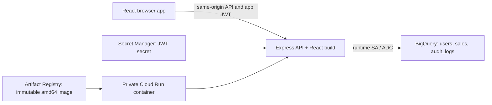

# Sales Insight Dashboard

A proof-of-concept sales analytics dashboard built with React, Express,
JWT authentication, role-based access control, and Google BigQuery. A Docker
image packages the application and has been validated locally. GCP
preparation, image publication, and private Cloud Run deployment are complete.

## Current status

Phase 20 — Final Verification and Documentation is complete. The private Cloud
Run service is healthy. Real BigQuery reads/writes, JWT/session checks, and RBAC
pass for Admin, Analyst, and Viewer. Final checks include 54 backend tests,
31 browser tests, client lint/build, and local Docker smoke validation.

The dataset contains **3 users, 750 sales, and 19 audit logs**. Temporary test
sales were deleted and the Viewer role was restored; the six new audit records
are retained. Runtime IAM is currently granted at project scope by the mentor,
broader than the original scoped plan.

See [final results and limitations](scripts/gcp/FINAL_VERIFICATION.md) and
[deployment/private browser access](scripts/gcp/CLOUD_RUN_DEPLOYMENT.md).
Historical phase results below retain the data counts recorded at that time.

## Architecture and tech stack



React 19, Vite 8, React Router, Tailwind CSS, and Recharts provide the UI.
Express 5 uses bcrypt, one-hour JWTs, current-user RBAC, Helmet, and the Google
BigQuery SDK. Node 24 runs in a multi-stage Docker image as a non-root user.
Cloud Run uses its attached SA for BigQuery and reads JWT_SECRET from Secret
Manager. Google IAM authentication protects the service before app login.

## Role permissions

| Action | Viewer | Analyst | Admin |
|---|---|---|---|
| View dashboard, transactions, analytics | Yes | Yes | Yes |
| Create sales | No | Yes | Yes |
| Delete sales | No | No | Yes |
| List users / change roles | No | No | Yes |
| View audit logs | No | No | Yes |

Backend guards check the current active BigQuery user on each protected request.
Changing roles affects existing sessions; frontend visibility is not the security
boundary. Password hashes and JWT secrets are never exposed in API responses.

## Repository structure

```text
client/       React frontend built with Vite
server/       Independent Express API
scripts/      BigQuery setup SQL and instructions
.env.example  Placeholder environment configuration
.gitignore    Local files and generated output to exclude from Git
```

The implementation plan is in
[CODEX_BUILD_PLAN_SALES_INSIGHT_DASHBOARD.md](CODEX_BUILD_PLAN_SALES_INSIGHT_DASHBOARD.md).
Work proceeds one phase at a time, with an explicit instruction required to
begin the next phase.

## Local frontend setup

Use Node.js 22.13+ on the 22.x release line, or Node.js 24+. The frontend was
validated with Node.js 24.21.0 and npm 11.19.0.

From the repository root:

```bash
cd client
npm install
npm run dev
```

Open the local URL printed by Vite (normally `http://localhost:5173`).
The root URL redirects to `/dashboard`. Anonymous workspace visits redirect
to `/login`. Start the Express backend on port 8080 to sign in; Vite proxies
`/api` requests to it. See [frontend authentication setup](client/AUTHENTICATION.md).

Available routes:

- `/login`
- `/dashboard`
- `/transactions`
- `/analytics`
- `/users`
- `/audit-logs`

The sidebar highlights the active page. On smaller screens, use the
navigation toggle to show or hide the sidebar. Wide tables scroll within
their panels. Unknown routes display a link back to the dashboard.

From `client/`, run the frontend checks and production preview:

```bash
npm run lint
npm run build
npm run preview
```

The production build is generated in `client/dist/` and is ignored by Git.
The preview command serves that build locally. For the complete application
through Express, follow [the production guide](server/PRODUCTION.md).

## Local backend setup

From the repository root, using the same Node.js versions as the frontend:

```bash
cd server
npm install
npm run dev
```

The development script uses Node's watch mode. For a normal start, run
`npm start` from `server/`. The API listens on `0.0.0.0` and defaults to
port 8080. To use a different port:

```bash
PORT=18083 npm start
```

Verify the default health endpoint:

```bash
curl --fail-with-body http://localhost:8080/api/health
```

Expected HTTP 200 response:

```json
{"status":"ok","service":"sales-insight-dashboard"}
```

From `server/`, run the backend checks:

```bash
npm run check
npm test
```

`check` validates application JavaScript syntax. The tests use Node's
built-in test runner and temporary local HTTP listeners, so they do not
require a running server, database, or Google Cloud credentials.

## BigQuery setup

Local SDK access uses Application Default Credentials, separate from CLI login:

```bash
gcloud auth application-default login
gcloud auth application-default set-quota-project id-fpoc-0608-data-posindo
```

Copy `.env.example` to an ignored root `.env` and configure the variables listed
under Environment configuration. Existing app resources use project
`id-fpoc-0608-data-posindo`, dataset `sales_dashboard`, location `asia-southeast2`.
The three tables are `users`, `sales`, and `audit_logs`. See
[dataset/table setup](scripts/bigquery/README.md) and
[demo seed/credential instructions](scripts/bigquery/SEEDING.md).
Resources are already created and seeded in this project; do not repeat setup
or reseed for ordinary startup. New environments should follow those guides
with their own explicit resource boundaries.

## Docker build and run

From the repository root with Docker running:

```bash
docker build -t sales-insight-dashboard .
node scripts/docker/run-local.mjs
```

Open http://127.0.0.1:8080/login. The runner supplies local ADC/configuration
through temporary runtime files and cleans up its own container on Ctrl+C.
See [Docker build details](server/CONTAINER_IMAGE.md) and
[local Docker configuration](scripts/docker/LOCAL_DOCKER.md).
Cloud Run uses the separately published linux/amd64 image; deployed settings
and immutable URI are in [the deployment guide](scripts/gcp/CLOUD_RUN_DEPLOYMENT.md).

## API summary

All paths are under `/api`. Protected endpoints require `Authorization: Bearer`
with an app JWT. Direct private Cloud Run requests also need Google IAM
authentication, using `X-Serverless-Authorization` for the Google ID token.

| Method / path | Access | Purpose |
|---|---|---|
| GET `/health` | No app JWT | Health; Cloud Run IAM still applies |
| POST `/auth/login` | No app JWT | Login with email/password |
| GET `/auth/me` | Any active role | Current user/session |
| GET `/dashboard/summary`, `/dashboard/revenue-trend` | All roles | Dashboard reports |
| GET `/analytics/products`, `/analytics/regions`, `/analytics/top-products` | All roles | Analytics reports |
| GET `/sales` | All roles | Paginated sales |
| POST `/sales` | Admin, Analyst | Create sale and audit |
| DELETE `/sales/:id` | Admin | Delete sale and audit |
| GET `/users` | Admin | Paginated public user records |
| PATCH `/users/:id/role` | Admin | Change role and audit |
| GET `/audit-logs` | Admin | Paginated audit records |
| GET `/access/:permission` | Permission-dependent | Read-only RBAC probes |

Sales input: `sale_date`, `product`, `category`, `region`, `quantity`, `revenue`,
`cost`. Use decimal strings for monetary amounts. Role updates accept
`{ "role": "analyst" }`, with role set to `admin`, `analyst`, or `viewer`. List endpoints accept `limit`
(1–100, default 50) and `offset` (0–1,000,000, default 0).

## Final verification

```bash
npm run check --prefix server
npm test --prefix server
npm run lint --prefix client
npm run build --prefix client
node scripts/gcp/validate-cloud-run.mjs
```

The Cloud Run validator requires authenticated CLI tools, Playwright Chromium,
and demo credentials in macOS Keychain. It performs read-only live checks and
31 browser fixture tests. To explicitly repeat the live mutation verification:

```bash
node scripts/gcp/verify-final.mjs --run-demo-writes
```

That command creates/deletes two temporary demo sales and changes/restores the
Viewer role. It intentionally retains six audit records per successful run.
Only run it in the existing app-owned demo environment. See
[final verification report](scripts/gcp/FINAL_VERIFICATION.md) for evidence,
cleanup, architecture, and known limitations.

## Backend foundation

The backend uses Express, CORS, dotenv, and Helmet:

- `server/app.js`: middleware setup and route registration; importing it
  does not start a listener.
- `server/index.js`: listener startup and startup error handling.
- `server/config/env.js`: root `.env` loading and port validation.
- `server/config/bigquery.js`: lazy ADC-based BigQuery client configuration.
- `server/services/bigqueryService.js`: reusable parameterized GoogleSQL queries.
- `server/scripts/checkBigQuery.js`: standalone live connection check.
- `server/routes/healthRoutes.js`: health route definition.
- `server/controllers/healthController.js`: health response.
- `server/middleware/`: JSON 404 and centralized error responses.
- `server/utils/`: placeholder for later phases.
- `server/test/app.test.js`: HTTP behavior and configuration checks.

Unknown API routes and missing files return HTTP 404 with
`{"success":false,"message":"Not found"}`. Malformed JSON returns HTTP
400; JSON bodies exceeding 100 KB return HTTP 413. Internal errors return
a generic HTTP 500 response without internal messages or stack traces.
Helmet sets security headers, and the Express identification header is
disabled. CORS grants only explicitly configured `CORS_ORIGINS`; the default
same-origin setup and Vite proxy need no cross-origin grant. Production uses
Helmet CSP/HSTS; HTTP development disables HTTPS upgrading and HSTS.

The frontend runs through Vite and proxies `/api` requests to Express.
The API includes authentication, sales, dashboard, analytics, user management,
and audit-log endpoints. Express also serves `client/dist` when built, with
React fallback after API routes and static assets.

## Frontend foundation

The frontend uses React, Vite, Tailwind CSS, React Router, Lucide React,
Recharts, and shadcn/ui. shadcn/ui is initialized for JavaScript with the neutral
Radix Nova style, a shared Button component, and a locally bundled Geist
font. Both Vite and the editor resolve `@/` imports to `client/src/`.

- `src/App.jsx`: route definitions and the default redirect.
- `src/lib/navigation.js`: page names, icons, and navigation metadata.
- `src/layouts/DashboardLayout.jsx`: shared header and responsive layout.
- `src/components/Sidebar.jsx`: sidebar links and active states.
- `src/pages/`: dashboard, transactions, analytics, users, audit logs,
  login, and the unknown-route page.
- `src/services/workspace.js`: workspace API services.
- `src/hooks/useApiData.js`: cancellable loading, error, and refresh handling.
- `src/lib/format.js`: IDR currency and Asia/Jakarta date formatting.
- `src/components/`: shared page headers, stat cards, panels, data tables,
  role badges, loading/empty states, and charts.
- `src/index.css`: Tailwind imports, theme, and base styles.

## Phase 2 static mockup (historical)

The following records describe the original mockup. Phase 13 removed these
fixtures and connected all core pages to the APIs.

- Dashboard: Total Revenue, Total Orders, Average Order Value, Top Product,
  a revenue trend chart, leading products, and recent transactions.
- Transactions: all eight planned columns and a local search across product,
  category, region, creator, and transaction ID. An unmatched search displays
  the shared empty state.
- Analytics: Revenue Trend, Revenue by Product, Revenue by Region, and
  Top Products charts with currency tooltips and expandable data tables.
- Users: sample names, emails, role badges, statuses, and creation dates.
- Audit Logs: sample LOGIN, CREATE_SALE, DELETE_SALE, and UPDATE_ROLE events
  with timestamps displayed in WIB.

The fixtures contain 18 transactions across six products and five regions
for April–September 2026, five users, and six illustrative audit events.
Revenue totals and rankings derive from those same static transactions.
Total revenue is IDR 566,000,000; total orders counts transactions, while
quantity records the units in each transaction. Currency cards use compact
formatting, and chart axes display millions of IDR.

The header labels the content as sample data. Transaction search runs only
in the browser. Role badges are display-only, and the tables are read-only.
The chart module loads separately with a shared loading state so Recharts
is not included in the initial application bundle.

## Phase 2 validation

- Dependency installation, ESLint, and the production build passed.
- Vite started successfully on `127.0.0.1:5173`.
- Static data checks confirmed equal revenue totals across the summary,
  monthly trend, products, and regions, plus coverage of all roles and audit
  action types.
- Chrome checks passed for all six routes, refresh, page titles, chart
  dimensions, and expected table/row counts. Transaction search and empty
  state recovery passed.
- All routes passed at 320, 390, and 768 pixels with no page-level horizontal
  overflow. Desktop and mobile screenshots were visually reviewed.
- The production preview passed for direct navigation to analytics, lazy
  chart loading, the loading fallback, four charts, and currency tooltips.
- Final browser checks reported no API requests, console/runtime errors,
  chart size warnings, or HTTP resource errors.

## Phase 3 validation

- Backend dependencies installed successfully with zero reported npm audit
  vulnerabilities.
- JavaScript syntax checks and all seven backend tests passed.
- `npm start` served the expected health response on port 8080.
- `PORT=18083 npm run dev` served the same response on the configured port.
- Live HTTP checks confirmed JSON 404 and malformed-body 400 responses.
- Tests verified security headers, CORS preflight, oversized-body 413,
  sanitized synchronous/asynchronous 500 responses, default/custom ports,
  and invalid-port rejection.

## Phase 4 setup and validation

See [the step-by-step BigQuery guide](scripts/bigquery/README.md) for Google
login, permissions, dataset/table creation, and connection validation.

- Installed `@google-cloud/bigquery` and the local Google Cloud CLI.
- Added SQL for `sales_dashboard.users`, `sales_dashboard.sales`, and
  `sales_dashboard.audit_logs`, plus dataset creation SQL.
- Configured the target project `id-fpoc-0608-data-posindo` and
  Jakarta location (`asia-southeast2`). A local ignored `.env` contains
  only non-secret configuration.
- On 2 October 2026, confirmed `sales_dashboard` did not exist, then created
  it in Jakarta with empty `users`, `sales`, and `audit_logs` tables. Only
  these new resources were targeted; no existing datasets, tables, IAM, or
  project settings were modified.
- SQL uses strict `CREATE` statements: existing resources cause an error
  rather than being reused or replaced. Do not rerun setup against an
  existing dataset.
- At the end of Phase 4, all three table schemas matched the build plan
  and contained zero rows.
- Local syntax checks and all ten backend tests passed. The live
  `npm run check:bigquery` succeeded using ADC, and the running Express
  health endpoint returned HTTP 200 with the expected service JSON.

## Phase 5 seed and validation

See [the demo seeding guide](scripts/bigquery/SEEDING.md) for demo accounts,
Keychain password retrieval, safe reruns, and validation details.

- Added deterministic sales generation, bcrypt user hashing, and
  `npm run seed` in `server/`.
- Seeded only `id-fpoc-0608-data-posindo.sales_dashboard`: three active
  demo users and 750 transactions covering six products, five regions,
  and April–September 2026. Audit logs remain empty.
- Passwords are stored in macOS Keychain; BigQuery contains bcrypt hashes
  with cost factor 12. No plaintext passwords are stored in repo files.
- Seed reruns insert missing records only, preserve existing rows and
  credentials, and abort on conflicting user identities.
- Live validation confirmed each bcrypt hash matches its demo password.
  Rerun checks confirmed unchanged row digests, no duplicates, and no
  changes to audit logs.
- Syntax checks, all 12 backend tests, the BigQuery connection check, and
  the live health endpoint passed.

## Phase 6 authentication and validation

See [the backend authentication guide](server/AUTHENTICATION.md) for local
secret setup, API contracts, and validation details.

- Added `POST /api/auth/login` and authenticated `GET /api/auth/me`.
- Login uses parameterized BigQuery queries, checks active status, verifies
  bcrypt passwords, and issues one-hour HS256 JWTs with safe user data.
- Authentication rejects invalid tokens; `/me` checks the current user's
  active status in BigQuery. Password hashes and secrets are never returned.
- Syntax checks and all 19 backend tests passed. Live login and `/me` checks
  passed for all three demo roles. Invalid credentials and missing tokens
  returned 401, and health returned 200.
- BigQuery counts remained three users, 750 sales, and zero audit logs;
  authentication did not modify cloud resources.

## Phase 7 role authorization

See [the backend RBAC guide](server/RBAC.md) for the permission matrix,
reusable middleware, and read-only `/api/access/<permission>` checks.

- Added `authorizeRoles(...)` for Admin-only operations, Admin/Analyst sales
  creation, and read permissions for all three roles.
- Each guard checks the current active user and role in BigQuery so revoked
  privileges are not retained by previously issued tokens.
- Missing/invalid JWTs return 401; insufficient roles return 403. The access
  probes only demonstrate authorization; they do not perform business actions.
- Syntax checks and all 26 backend tests passed. Live checks passed for all
  eight permissions across the three demo accounts (24 permission checks).
  Every probe rejected missing/invalid JWTs with 401, and health returned 200.
- BigQuery counts remained three users, 750 sales, and zero audit logs; no
  cloud resources or records were changed.

## Phase 8 sales API

See [the sales API guide](server/SALES_API.md) for requests, responses,
validation limits, pagination, and transactional audit behavior.

- `GET /api/sales`: all three roles can list sales with bounded pagination.
- `POST /api/sales`: Admin/Analyst can create; Viewer receives 403.
- `DELETE /api/sales/:id`: Admin can delete; Analyst/Viewer receive 403.
- Server-generated IDs and authenticated user identities prevent client
  impersonation. Dates, text, quantities, monetary values, and IDs are validated.
- Create/delete and their corresponding audit records are committed together.
  Missing sale deletions return 404 without creating an audit record.
- Syntax checks and all 33 backend tests passed. Live BigQuery checks verified
  listing, role restrictions, exact monetary values, create/delete audits,
  and rollback after an intentional transaction failure.
- The two validation sales were deleted using the Admin API. The original
  750 seed sales and three user records remained unchanged; four validation
  create/delete audit records were retained. No other project resources changed.

## Phase 9 dashboard and analytics API

See [the reporting API guide](server/REPORTING_API.md) for response contracts,
metric definitions, ordering, empty-table behavior, and numeric precision.

- Added dashboard summary and monthly revenue trend endpoints.
- Added product, region, and top-five-product aggregation endpoints.
- All three active roles can read reports. Calculations run in BigQuery;
  the backend returns chart-friendly aggregate data.
- Reports only read the application dataset and do not create audit logs.
- Syntax checks and all 39 backend tests passed. `npm --prefix server run
  check:reporting` validated all five endpoints across the three demo roles,
  seed aggregate totals, empty sources, revenue ties, and exact NUMERIC ranking.
- Summary returned revenue 32,052,442,000 from 750 orders, with
  `App Modernization` as the top product.
- All table counts and row digests were unchanged: three users, 750 sales,
  four audit logs. Other project resources were not modified.

## Phase 10 user management and audit API

See [the management API guide](server/MANAGEMENT_API.md) for safe user fields,
role updates, audit details, and validation instructions.

- Added Admin-only `GET /api/users`, `PATCH /api/users/:id/role`, and
  `GET /api/audit-logs` with bounded list pagination.
- Only admin/analyst/viewer roles are accepted. User responses never expose
  password hashes. Actual role changes and their `UPDATE_ROLE` audit records
  are committed together; unchanged roles add no audit record.
- Syntax checks and all 46 backend tests passed. Live integration verified
  Admin access, Analyst/Viewer rejection, role/audit updates, immediate JWT
  permission changes, and rollback on audit failure.
- The uniquely identified validation user was removed. Existing users, sales,
  and prior audits remained unchanged. Final counts: three users, 750 sales,
  seven audit logs; three role validation audits were retained.

## Phase 11 frontend authentication

See [the frontend authentication guide](client/AUTHENTICATION.md) for startup,
session behavior, and browser validation.

- Added a responsive login form, `AuthContext`, API layer, protected routes,
  signed-in user display, and logout.
- JWTs are stored in tab-scoped sessionStorage. Login and reload validate
  the session through `/api/auth/me`; authenticated 401 responses clear it.
- Temporary session verification errors permit retry without displaying
  protected content. Login restores the requested workspace destination.
- ESLint, production build, and all seven Chromium browser tests passed.
  Live browser checks passed for all three demo accounts through the real
  Vite proxy, Express, and BigQuery, including reload and logout.
- BigQuery counts/digests remained unchanged: three users, 750 sales,
  seven audit logs. No business APIs were called by the frontend.

## Phase 12 frontend permissions

See [the frontend RBAC guide](client/RBAC.md) for the role matrix,
route guards, action visibility, and validation.

- Added `hasRole()`/`can()` helpers, filtered navigation, permission guards
  for direct routes, and a current-role badge that remains visible on mobile.
- Only Admin sees Users/Audit Logs pages. Admin/Analyst see Create transaction;
  only Admin sees Delete actions. Sample-data controls remain disabled.
- ESLint, production build, and all 20 browser tests passed. Live checks with
  all three demo accounts matched UI permissions and backend guards.
- Counts and full-row digests remained unchanged: three users, 750 sales,
  seven audit logs. No frontend business API calls were introduced.

## Phase 13 workspace API integration

See [the workspace API guide](client/WORKSPACE_API.md) for page contracts,
mutation behavior, pagination, and validation details.

- Replaced all core mock data with API services, loading/empty/error states,
  retry, and refresh. Charts and dashboard metrics now use BigQuery results.
- Added transaction creation for Admin/Analyst, confirmed deletion for Admin,
  and Admin role editing with refreshed rows and current-session validation.
- ESLint, production build, and all 29 Chromium browser tests passed.
  Live UI checks through Vite, Express, and BigQuery passed for all three roles.
- Temporary test users/sales were removed. Original users, sales, and existing
  audit rows remained unchanged. Six mutation audit records were retained;
  final counts are three users, 750 sales, and 13 audit logs.

## Phase 14 production integration

See [the production guide](server/PRODUCTION.md) for routing, headers,
configuration, and detailed validation.

```bash
npm --prefix client run build
NODE_ENV=production PORT=8080 npm --prefix server start
```

Open `http://127.0.0.1:8080`; Vite is not required for production serving.
Direct React routes support refresh, while missing APIs/assets remain JSON 404.
Production requires a build. HTML revalidates; hashed assets use immutable caching.

- Server syntax checks, frontend lint, and the production build passed.
- 54 backend tests, 29 Vite browser tests, and 31 Express production browser
  tests passed, including the existing auth/RBAC/workspace coverage.
- Real production browser checks with all three accounts passed, with no
  runtime/CSP errors. Data counts and full-row digests remained unchanged:
  three users, 750 sales, and 13 audit logs.

## Phase 15 container image

Created `Dockerfile` and `.dockerignore`. The build generates React in Linux,
installs backend production dependencies, and copies the production app into
an official Node.js runtime pinned by digest. The runtime uses the non-root
`node` user and default port 8080. Secrets and unnecessary files are excluded.

```bash
docker build -t sales-insight-dashboard .
```

Build, Dockerfile checks, filtered-context checks, and image inspections passed.
The local image is linux/arm64 (84.8 MB reported by Docker). Inspection used a
stopped container that was removed; the application was not started in Docker.
See [the image guide](server/CONTAINER_IMAGE.md) for validation details.

## Phase 16 local Docker deployment

The container passed real login/BigQuery checks for all three roles, direct
navigation/refresh, dashboard/charts, transactions, Admin user management,
audit logs, and the complete backend permission matrix. All 31 browser tests
against the container passed, along with syntax/lint/whitespace checks.
Data counts and full-row digests stayed unchanged: three users, 750 sales,
13 audit logs. Validation used no successful cloud mutations.

```bash
node scripts/docker/run-local.mjs
```

Open `http://localhost:8080`. The helper mounts temporary ADC/config files
read-only, generates a local JWT secret, and publishes only to localhost.
Ctrl+C stops/removes its container and cleans up its temporary credentials.
The validation container was stopped afterward; run the command to restart it.
See [the local Docker guide](scripts/docker/LOCAL_DOCKER.md) for details.

## Phase 17 GCP deployment preparation

Selected `id-fpoc-0608-data-posindo` and enabled Artifact Registry, Cloud Run,
and IAM APIs. BigQuery, Logging, and Secret Manager were already enabled.
Created only the dedicated standard Docker repository `sales-insight-dashboard`
in `asia-southeast2`. No existing workload or dataset ACL was modified.

Expected future image path:

```text
asia-southeast2-docker.pkg.dev/id-fpoc-0608-data-posindo/sales-insight-dashboard/sales-insight-dashboard:TAG
```

The [preparation guide](scripts/gcp/DEPLOYMENT_PREPARATION.md) records commands,
resource purposes, deployer permissions, and a planned dedicated runtime account
with custom BigQuery roles scoped to SQL jobs and the three app tables. Runtime
account/custom-role creation and bindings are planned, not applied. The future
cloud image must include linux/amd64; the tested local image is arm64.

Project/API/repository checks passed. Repository image listing and target-region
Cloud Run service listing are empty; dataset metadata/ACL is unchanged. Cloud
Build was not enabled. No image push or deployment was performed.

## Phase 18 image publication

Built and tested a fresh linux/amd64 image, then pushed it to:

```text
asia-southeast2-docker.pkg.dev/id-fpoc-0608-data-posindo/sales-insight-dashboard/sales-insight-dashboard:git-6653fac73558
```

All 31 browser tests passed on the amd64 container. Real BigQuery login, core
pages, direct-route refresh, and the complete RBAC matrix passed for all three
roles. Counts/digests remained unchanged: three users, 750 sales, 13 audit logs.
The remote digest matches the tested image and its manifest includes linux/amd64.

See [publication commands and immutable image URI](scripts/gcp/IMAGE_PUBLICATION.md)
and [release metadata](scripts/gcp/image-release.json). Runtime identity/IAM and
JWT-secret setup remain required before deployment. Validation containers and
temporary credentials were cleaned up.

Phase 18 is complete. Phase 19 preparation is recorded below; Cloud Run is not deployed.

## Phase 19 private Cloud Run deployment

Deployed the tested Artifact Registry container by immutable digest to
`sales-insight-dashboard` in `asia-southeast2`. Ready revision
`sales-insight-dashboard-00001-hxz` serves 100% of traffic. Cloud Run uses the
`sales-insight-runtime` SA, port 8080, the app's BigQuery configuration, and
Secret Manager reference `sales-insight-jwt:1`.

[Service URL](https://sales-insight-dashboard-797252500656.asia-southeast2.run.app)
requires Google IAM authentication. For browser access, run:

```bash
gcloud run services proxy sales-insight-dashboard \
  --project=id-fpoc-0608-data-posindo --region=asia-southeast2 --port=8081
```

Then open http://127.0.0.1:8081/login and log in with the app credentials.
The authenticated proxy was tested with real login and preserves the app JWT.

Unauthenticated requests are denied; authenticated health, React routes, real
BigQuery login/APIs, and 24 RBAC probes pass. All 31 browser fixture tests also
pass against the deployed container. Counts/full-row digests are unchanged:
three users, 750 sales, 13 audit logs. No production data mutations were tested
in this phase. The dataset ACL and other workloads were not modified.

Mentor granted runtime Job User, Data Editor, and Secret Accessor at project
scope. Those grants were retained and are broader than the original scoped IAM
plan; narrowing them remains an administrator action. No deployment IAM binding
was added. Historical setup guides describe the earlier proposed handoff.

See [commands and validation results](scripts/gcp/CLOUD_RUN_DEPLOYMENT.md) and
[release metadata](scripts/gcp/cloud-run-release.json). Phase 19 is complete;
Phase 20 final results are documented above.

## Environment configuration

The backend optionally reads `.env` at the repository root. Its path is
resolved relative to the configuration file, so startup works independently
of the current working directory. Existing process environment variables
take precedence over `.env` values.

`NODE_ENV=production` requires the React build and enables production headers.
`CORS_ORIGINS` optionally grants exact comma-separated HTTP(S) origins; it
defaults to empty. `PORT` defaults to 8080 and must be an integer from 1 to
65535. BigQuery
uses `GOOGLE_CLOUD_PROJECT`, `BIGQUERY_DATASET` (default `sales_dashboard`),
and `BIGQUERY_LOCATION` (default `asia-southeast2`, which must match the
dataset location). `JWT_SECRET` must be a random secret of at least 32 bytes
for token issuance and verification; the example value must be replaced.
The health endpoint does not require BigQuery configuration or credentials.

Keep real secrets, passwords, and Google Cloud credentials out of the
repository. Use Application Default Credentials for local Google Cloud authentication;
Cloud Run uses its attached runtime service account.
